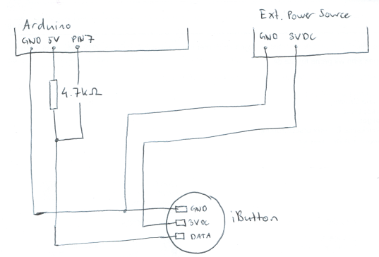
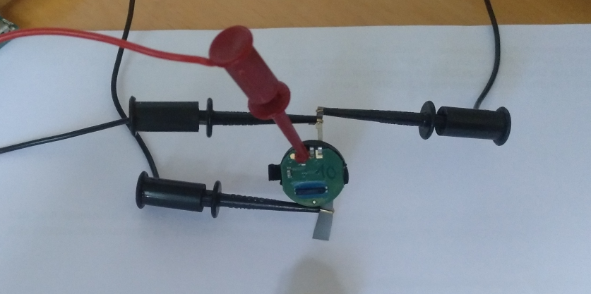

# Thermochron disaster recovery

This repository may help you in recovering "dead" iButton temperature loggers (DS1922L/DS1922T). However, don't see
this as a comprehensive guide - its more of a collection of notes and scripts and the target "audience" are clearly tech-savvy people.

## Requirements

- Arduino
- An external DC power source (3V)
- A 4.7k resistor
- Some thin wires
- Patience and a bit of imagination

## Some technical background

The entire iButton-family uses the [1-Wire-Protocol](https://en.wikipedia.org/wiki/1-Wire) to communicate with the master (usually your computer) and commands/data is
sent/received in 1-byte junks.

## Wiring



## Is it just the battery or is it worse?

To check if the battery is dead, you can simply try to read the scratchpad. This can be either done with "[OneWireViewer](https://www.maximintegrated.com/en/products/ibutton-one-wire/one-wire/software-tools/drivers/download-1-wire-ibutton-drivers-for-windows.html)"
or the Arduino script "[read_write_scratchpad.ino](scripts/read_write_scratchpad.ino)". 

If the check is successful, the output on the Arduino should look similar to this (baud rate is set to 115200) :

```text
Initialized, starting in 3 seconds...
1-Wire Device Detected, ID is:
41 62 CA 6C 0 0 0 4A 
TA1: 0
TA2: 2
TA-E/S: 1F
Scratchpad data: 1 2 3 4 5 6 7 8 9 A FF FF FF FF FF FF FF FF FF FF FF FF FF FF FF FF FF FF FF FF FF FF 
Done.
```

If the check fails (e.g. indicated through a CRC-16 error in OneWireViewer or just 'FF's everywhere in the Arduino output), then your battery is most likely dead and you can try to
power the iButton externally. I did this by opening the iButton housing, carefully disconnecting the battery at the bottom then connecting the fine metal strip to the negative
terminal of my external power supply. To connect the positive terminal, I just took a thin piece of metal and placed it between the circuit board and the upper side of the battery.



After the external power source is conn ected, try the "read scratchpad" command again. If it fails (and the device is detected), well, you can probably stop here :( 

## Reading memory

Simply load the "[dump_memory.ino](scripts/dump_memory.ino)" onto the Arduino, connect the iButton and wait until something like this appears on the terminal:

```text

Initialized, starting in 3 seconds...
1-Wire Device Detected, ID is:
41 62 CA 6C 0 0 0 4A 
-----begin dump----
0 0 0 0 0 0 0 0 0 0 0 0 0 0 0 0 0 0 0 0 0 0 0 0 0 0 0 0 0 0 0 0 9B 36 
...
----end dump----
```

Whereas the first 32 bytes are data and the last two are the crc-16 checksum. To convert this binary data to temperature readings, copy-paste the data between `-----begin dump----` and
`----end dump----` to a text file and point the `DUMP` variable in "[convert_bin.py](scripts/convert_bin.py)" to this text file. Afterwards, run the python file by typing `python3 convert_bin.py` 
in a terminal. This should generate two text files.


## Final notes

- The crc-16 check is not validated
- Logging frequency and other "mission" parameters are not extracted


